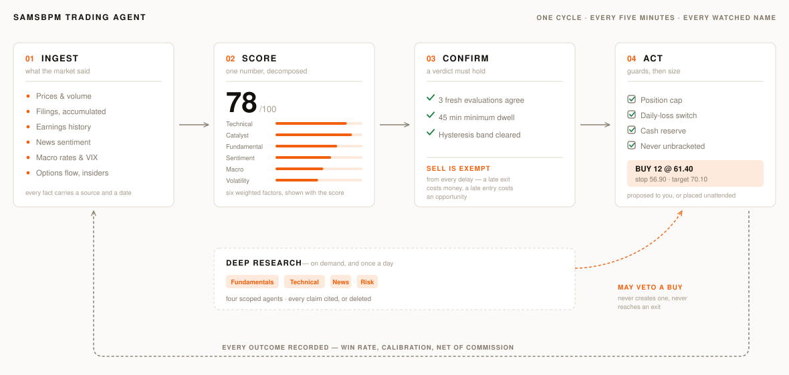

# SAMSTradingAgent — Stock Analysis & Decision Support System

Production-ready MVP backend for AI-powered stock analysis, built by SAMSBPM Technologies Inc.

> **Attribution:** This project is a derivative of [TradingAgents](https://github.com/TauricResearch/TradingAgents) by TauricResearch, licensed under the [Apache License 2.0](LICENSE). Modifications include the FastAPI service layer, MongoDB integration, APScheduler pipeline, Docker deployment, and risk/signal engine extensions.

## What it does

<picture>
  <source media="(prefers-color-scheme: dark)" srcset="frontend/public/img/pipeline-dark.svg">
  
</picture>

One cycle, every five minutes, on every watched name. Each stage records what
it did, so no step has to be taken on faith — the score arrives with its six
factors decomposed, a changed verdict must hold before it is published, and no
position opens without a stop and a target already on it.

*Regenerate with `python3 scripts/render_pipeline_diagram.py` — the geometry is
authored once there and both palettes derive from it.*

## Architecture

```
backend/
├── app/
│   ├── main.py              # FastAPI app + lifespan (startup/shutdown)
│   ├── config.py            # Pydantic settings from .env
│   ├── db.py                # Motor async MongoDB client
│   ├── models/
│   │   └── stock.py         # Pydantic schemas (request / response / DB docs)
│   ├── services/
│   │   ├── ingestion.py     # yfinance price fetch + mock sentiment
│   │   ├── feature_engineering.py  # RSI, MA-20/50, volatility, sub-scores
│   │   ├── scoring.py       # Weighted (+ XGBoost stub) composite scorer
│   │   ├── risk_engine.py   # Risk score 0-10 + LOW/MEDIUM/HIGH
│   │   ├── signal_generator.py     # BUY/SELL/HOLD + entry/exit hints
│   │   ├── pipeline.py      # Orchestrates the full pipeline
│   │   └── backtesting.py   # Backtest stub (MA-crossover demo)
│   ├── routes/
│   │   ├── health.py        # GET /health
│   │   ├── analysis.py      # GET /analyze?ticker=PLTR
│   │   └── signals.py       # GET /signals
│   ├── jobs/
│   │   └── scheduler.py     # APScheduler every N minutes
│   └── utils/
│       ├── logger.py        # structlog setup
│       └── helpers.py       # utcnow, clamp, safe_float
├── requirements.txt
├── Dockerfile               # Multi-stage build
├── docker-compose.yml
└── .env.example
```

## Signal Logic

```
score = 0.4 × technical_score + 0.3 × sentiment_score + 0.3 × volatility_score

BUY   →  score > 0.70  AND  risk_score < 6
SELL  →  score < 0.30
HOLD  →  otherwise
```

## Quick Start (local)

```bash
cd backend

# 1. Copy and fill environment variables
cp .env.example .env
#   → set MONGODB_URL to your Atlas URI or mongodb://localhost:27017

# 2. Create virtualenv
python -m venv .venv && source .venv/bin/activate

# 3. Install deps
pip install -r requirements.txt

# 4. Run
uvicorn app.main:app --reload --port 8000
```

Open http://localhost:8000/docs for interactive Swagger UI.

## Quick Start (Docker)

```bash
cd backend
cp .env.example .env   # fill in MONGODB_URL

docker build -t trading-agent .
docker run --env-file .env -p 8000:8000 trading-agent

# or with compose
docker compose up --build
```

## API Endpoints

| Method | Path | Description |
|--------|------|-------------|
| GET | `/health` | Liveness + DB status |
| GET | `/analyze?ticker=PLTR` | Full AI analysis for a ticker |
| GET | `/analyze?ticker=PLTR&force_refresh=true` | Force re-run (bypass 5-min cache) |
| GET | `/signals` | All latest signals |
| GET | `/signals?signal=BUY` | Filter by BUY/SELL/HOLD |
| GET | `/signals?min_confidence=0.6` | Filter by confidence |
| GET | `/backtest?ticker=PLTR` | Backtest stub (needs ENABLE_BACKTESTING=true) |
| GET | `/docs` | Swagger UI |

### Example response: GET /analyze?ticker=PLTR

```json
{
  "ticker": "PLTR",
  "score": 0.6821,
  "risk": {
    "risk_score": 4.3,
    "risk_level": "MEDIUM",
    "explanation": "Risk driven by: elevated volatility (38%)."
  },
  "signal": "HOLD",
  "confidence": 0.3,
  "entry_suggestion": null,
  "exit_suggestion": "Monitor; consider re-evaluating if price moves ±5% from $24.10",
  "explanation": "PLTR → HOLD | AI score=0.68 | Risk=MEDIUM (4.3/10) | MA trend=bullish | RSI=52.4. ...",
  "generated_at": "2026-06-18T10:00:00Z"
}
```

## MongoDB Collections

| Collection | Description |
|-----------|-------------|
| `stocks_raw` | OHLCV bars + mock sentiment (one doc per ticker) |
| `stocks_features` | RSI, MAs, volatility, sub-scores, composite score |
| `stocks_signals` | Latest BUY/SELL/HOLD signal per ticker |

## Configuration (.env)

| Variable | Default | Description |
|----------|---------|-------------|
| `MONGODB_URL` | `mongodb://localhost:27017` | Atlas URI or local |
| `MONGODB_DB_NAME` | `trading_agent` | Database name |
| `DEFAULT_TICKERS` | `PLTR,AAPL,TSLA,NVDA,MSFT` | Tickers to track |
| `INGESTION_INTERVAL_MINUTES` | `5` | Background pipeline frequency |
| `ENABLE_ML_MODEL` | `false` | Use XGBoost model if true + model file present |
| `ENABLE_BACKTESTING` | `false` | Enable /backtest endpoint |
| `LOG_LEVEL` | `INFO` | DEBUG / INFO / WARNING |

## Hetzner Deployment Notes

```bash
# On Hetzner VPS (Ubuntu 22.04)
apt install -y docker.io docker-compose-plugin

git clone <repo> && cd TradingAgent/backend
cp .env.example .env  # fill MONGODB_URL

docker compose up -d --build

# Optional: Caddy / nginx reverse proxy on port 443
```

## Extending the ML Scoring Model

1. Collect labelled training data: `{features} → future_return`
2. Train an XGBoost regressor in `notebooks/train_scorer.ipynb`
3. Export: `model.save_model("backend/model/xgb_scorer.json")`
4. Set `ENABLE_ML_MODEL=true` in `.env`

The scoring service will automatically load the model file at runtime.

## Market Data — Production Note

Current ingestion uses `yfinance`, which is suitable for development and internal use only.
Yahoo Finance's Terms of Service prohibit commercial redistribution of their data.
Before charging customers, replace `yfinance` in `backend/app/services/ingestion.py`
with a licensed provider (e.g. Polygon.io, Alpaca Markets, Refinitiv).

## License

Copyright 2026 SAMSBPM Technologies Inc.

Licensed under the Apache License, Version 2.0. See [LICENSE](LICENSE) and [NOTICE](NOTICE) for details.
